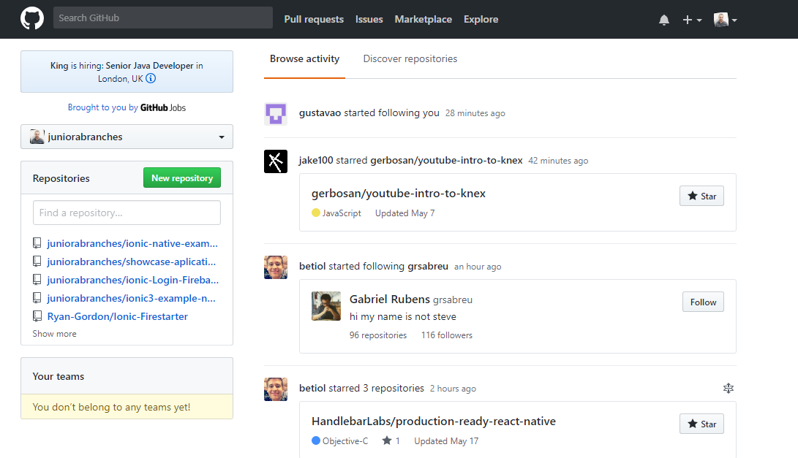
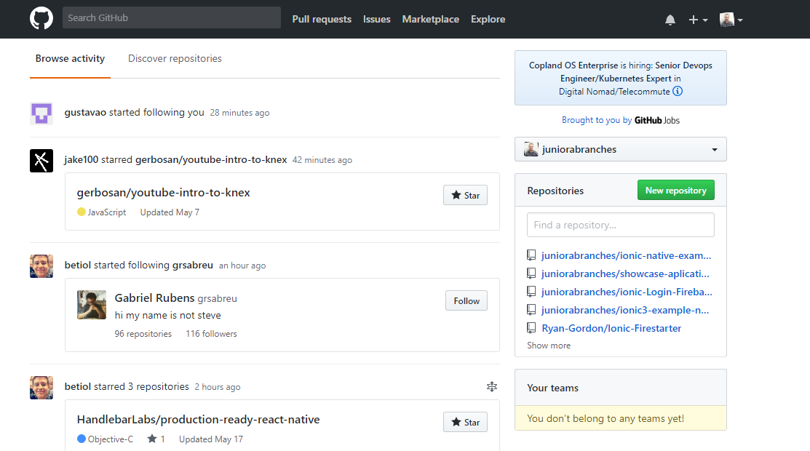

# chrome_extension_git_dashboard_right
Google chrome extension for github stay with the dashboard on the right side

## To use it

* To use it, you need to load it in the browser (type if you were installing):

* Go to the extension management page (chrome: // extensions).

* Now turn on the Developer Mode option by checking the box.

* Now you can click Load expanded extension ...

* Ready! Navigate to the folder where your manifest is, and click OK.

* Your extension should appear on the dashboard as if you had it installed at that time.

## Look this

* Not Extension

* With Extension

